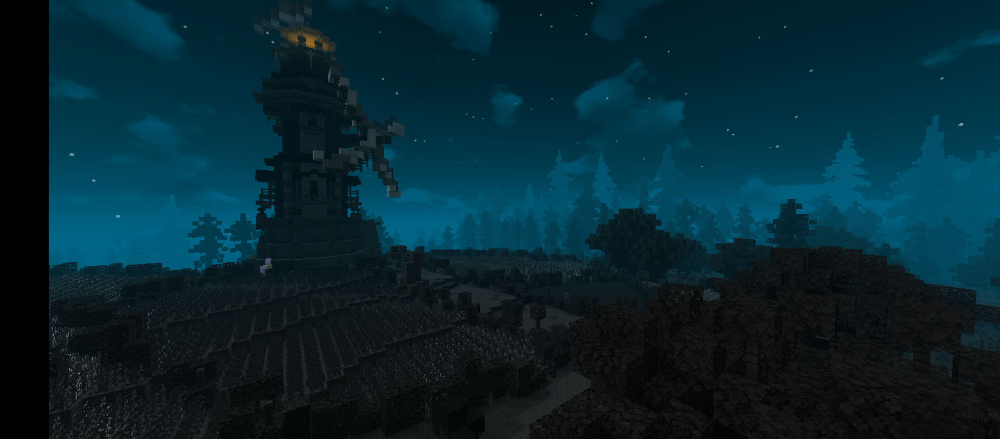
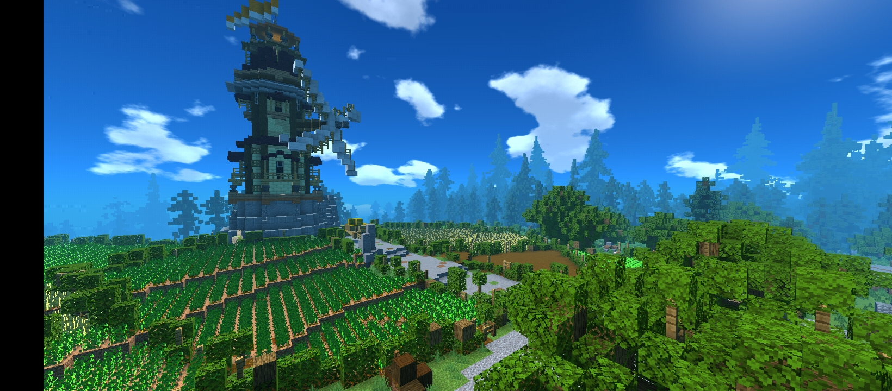
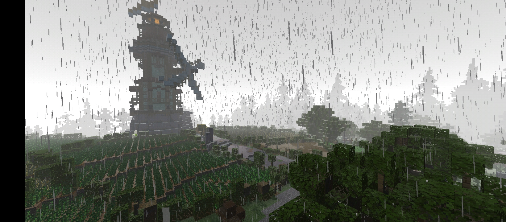
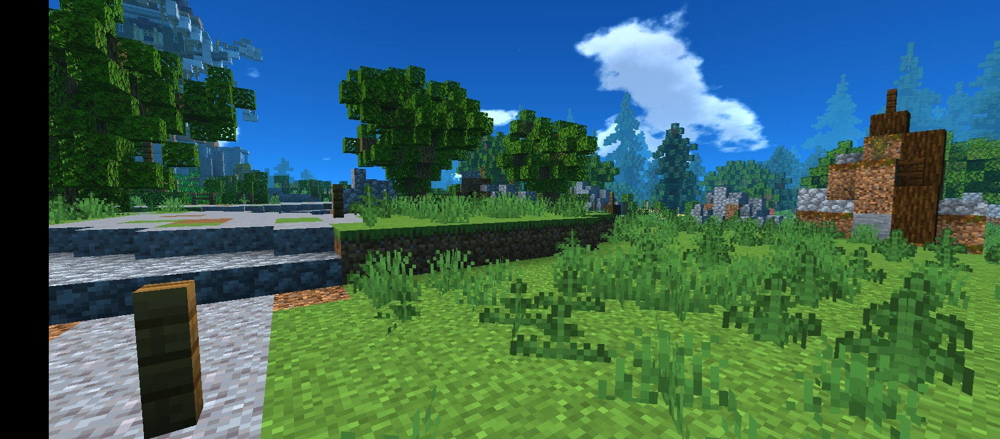
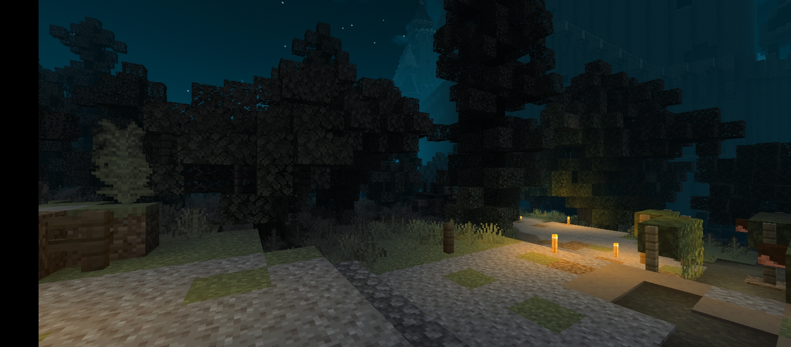
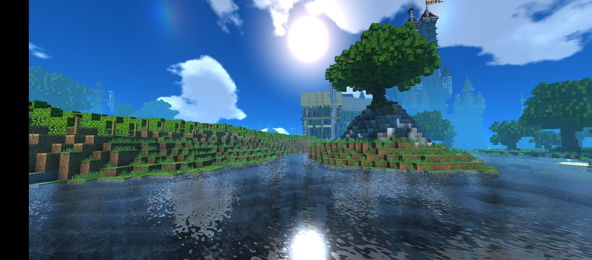
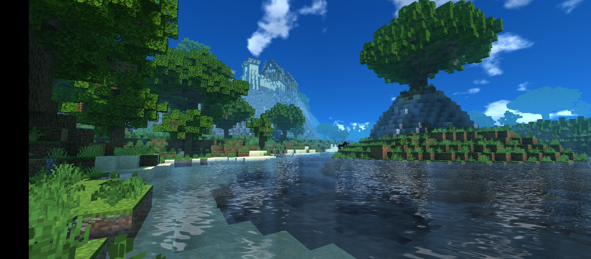
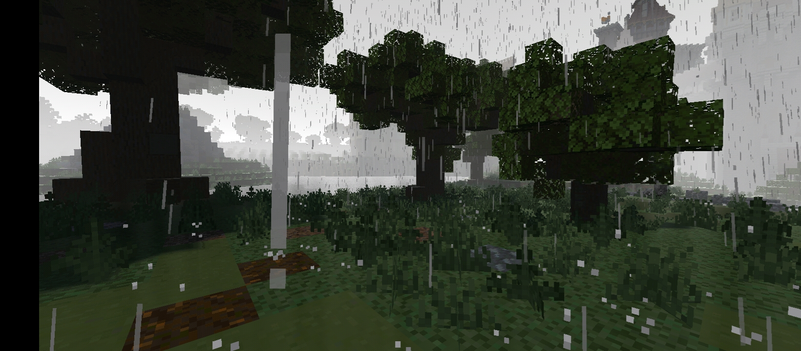

# Enhanced Visual Shaders ( EVPE )
A shaders project that made by a thai one.
Just a simple and lag shaders but have more Customizable!

This shaders is not final version, yet!
'Cause i have to quickly release this shaders before Render Dragon was Coming out...

If u find any bugs, u can report me or DM me from Discord!

## Screenshot
ill take more screenshot next update!

## Support PowerVR, Adreno and Mali ONLY!
'Cause i have only Adreno and Mali devices so im sure that's run fine!
But if u find bugs u can report or DM me from Discord!

So... however i have no PowerVR devices but im still fixed the bugs on it, don't worry!

## Not Compatible with Tegra or Apple!
'Cause i have no Tegra or Apple devices so i can't fix bugs on these devices...
So sorry About this but its not compatible with these gpu... 
