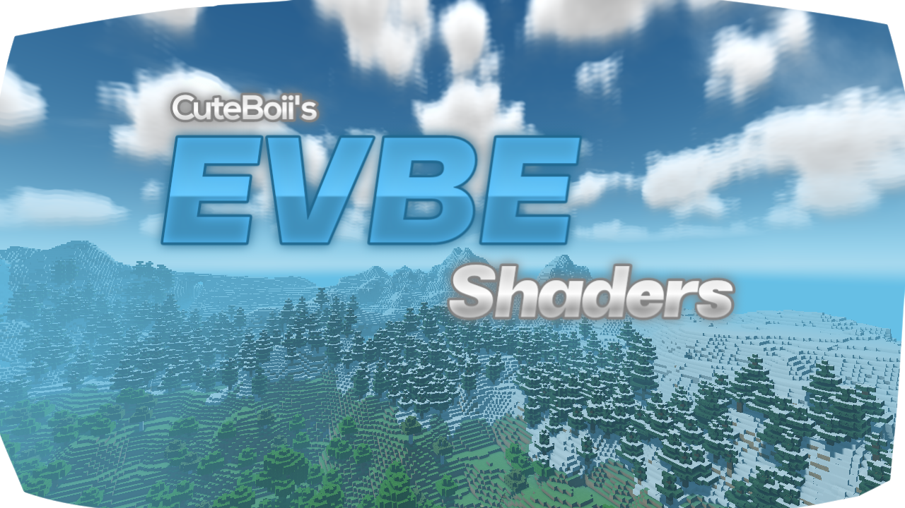
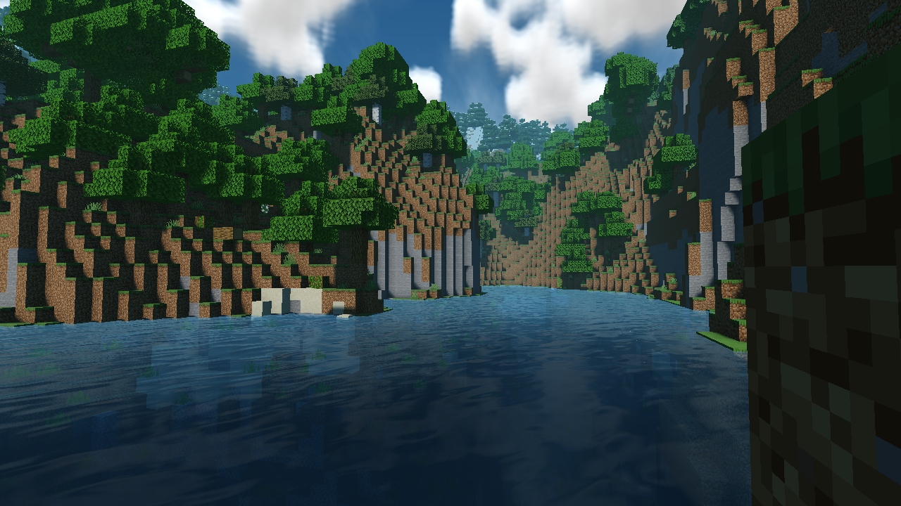
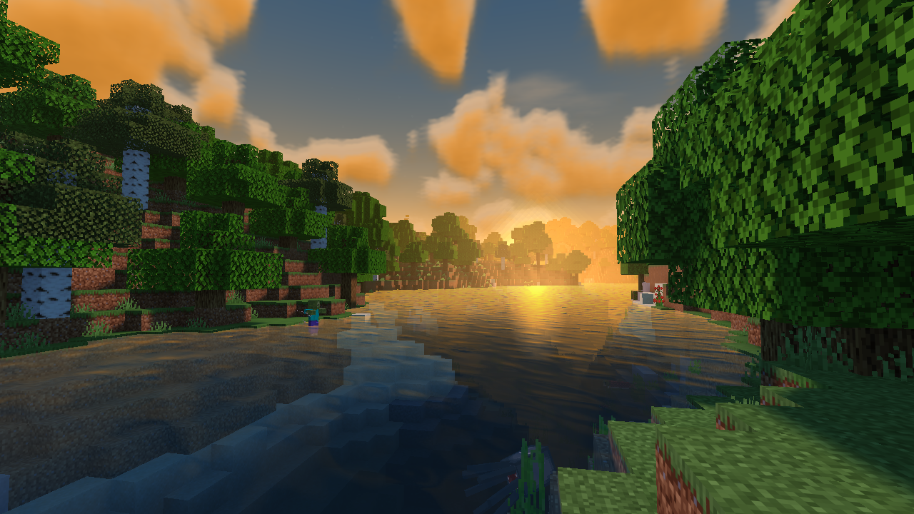

## Enhanced Visual Shaders ( EVBE )

A shaders project that made by a thai one.
Shaders for high-mid end devices

// Low version coming soon!

### Screenshot

#### More info

This shaders support :
- Windows 10 (no render dragon)
- Android (unsupport iOS)

also, this shaders still on beta progress, not full release.
so if u find any bugs or glitches please report here!

anyways, sorry that i didn't release 0.4-0.7.
it's can't be release, more like a trash, so sorry.

#### Download
[Enhanced Visual Shaders v0.8 _(Latest Version)_](https://github.com/ShieruG/Enhanced-Visual-Shaders/releases/download/0.8b/evpe_0.8.0.mcpack)
