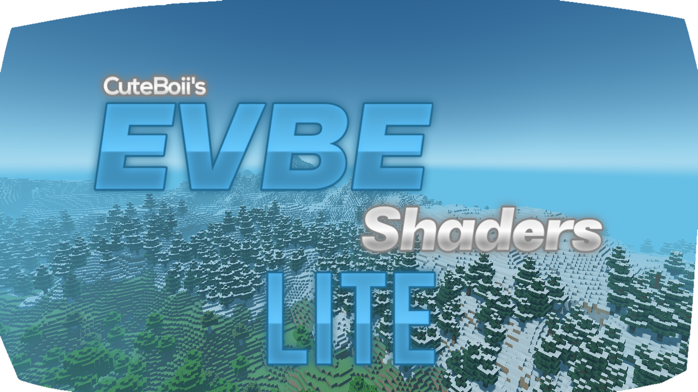
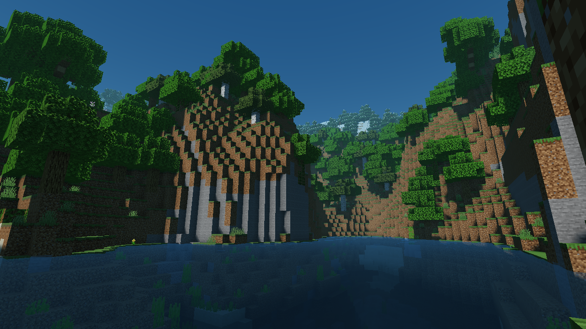
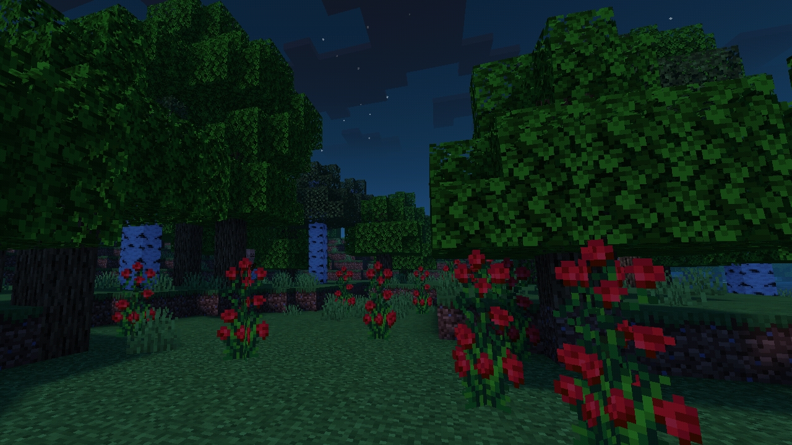

## Enhanced Visual Shaders Lite ( EVBE Lite )

A shaders project that made by a thai one.
Shaders for low-end Devices

### Screenshot

#### More info

This shaders support :
- `Windows 10 (no render dragon)`
- `Android & iOS`

`ps. iOS tested on iPhone 12 max.`

also, this shaders still on beta progress, not full release.
so if u find any bugs or glitches please report here!

#### Download
[ - Enhanced Visual Shaders v0.8 Lite (Latest Version)](https://github.com/ShieruG/Enhanced-Visual-Shaders/releases/download/0.8lb/evpe-lite_0.8.0.mcpack)

[ - Maximum Version of EVBE here](https://github.com/ShieruG/Enhanced-Visual-Shaders)

[ - All Version of EVBE here](https://github.com/ShieruG/Enhanced-Visual-Shaders/releases)
